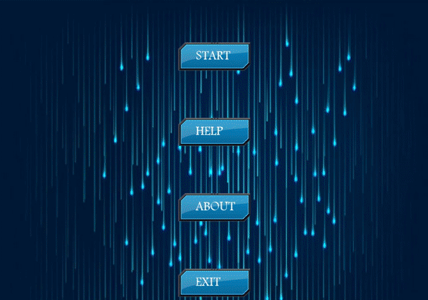

# 🛸SPACESHIP 👾MANIA
A space shooter game developed and designed using Object Oriented Programming (OOP) concepts in C++ and [Simple and Fast Multimedia Library(SFML)](https://www.sfml-dev.org/index.php)

## ⚙ Usage
```bash
git clone https://github.com/SrjPdl/Space-Shooter-Game.git
```
The project was made using [Code::Blocks](https://www.codeblocks.org/) IDE.

#### Tutorial links for setting up SFML in Code::Blocks
- https://www.sfml-dev.org/tutorials/2.5/start-cb.php
- http://www.edparrish.net/common/sfmlcb.html
  
  Use following for link Libraries in Code::Blocks.\
  `Link Libraries`
  
  ```
    sfml-graphics
    sfml-audio
    sfml-network
    sfml-window
    sfml-system
    ```

## 🎮 Controls
|Key|Action|
|---|---|
|<kbd>&larr;</kbd>|Move spaceship left|
|<kbd>&rarr;</kbd>|Move spaceship right|
|<kbd>Space</kbd>|Fire Bullets|

## 💻 Demo


## 🚀Author
**Suraj Poudel**

## License
[MIT License](https://opensource.org/licenses/MIT)

